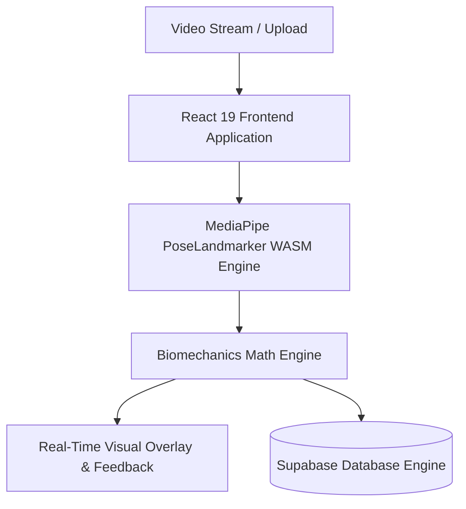
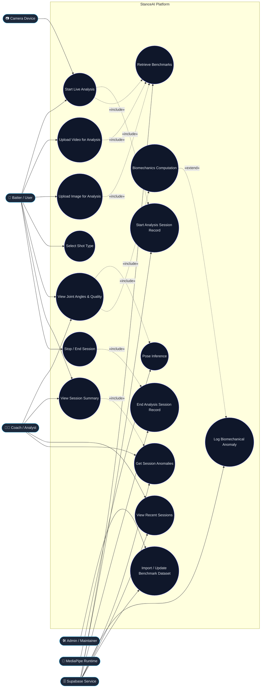
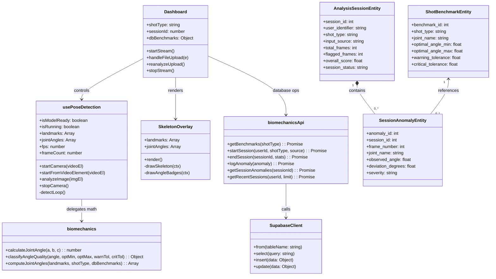
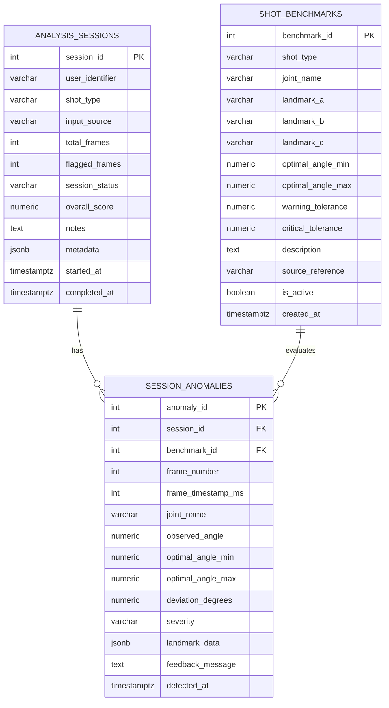
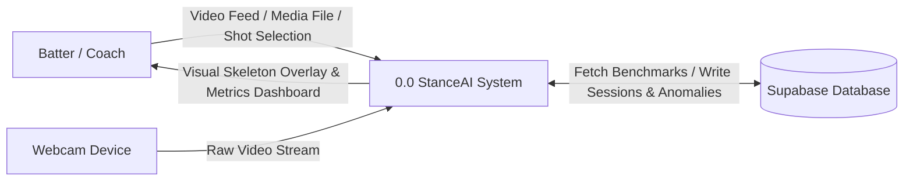
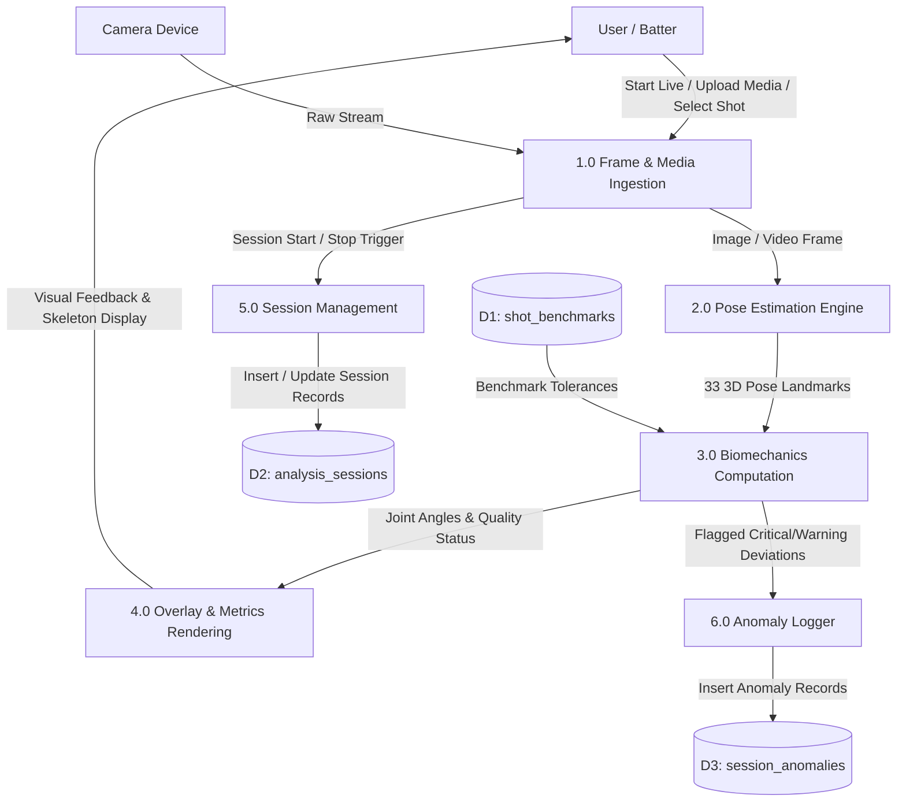

# Software Requirements Specification (SRS)
## Project Name: StanceAI — Biomechanical Cricket Analyzer

---

## Table of Contents
1. [1. Introduction](#1-introduction)
   - [1.1 Purpose of the Document](#11-purpose-of-the-document)
   - [1.2 Scope of the System](#12-scope-of-the-system)
   - [1.3 Definitions, Acronyms, and Abbreviations](#13-definitions-acronyms-and-abbreviations)
   - [1.4 References](#14-references)
   - [1.5 Overview of the Document](#15-overview-of-the-document)
2. [2. Requirement Engineering Process](#2-requirement-engineering-process)
   - [2.1 Feasibility Study](#21-feasibility-study)
   - [2.2 Requirement Elicitation and Analysis](#22-requirement-elicitation-and-analysis)
   - [2.3 Requirement Validation & Verification](#23-requirement-validation--verification)
   - [2.4 Requirement Management Plan](#24-requirement-management-plan)
3. [3. Overall Description](#3-overall-description)
   - [3.1 Product Perspective](#31-product-perspective)
   - [3.2 Product Functions](#32-product-functions)
   - [3.3 User Classes and Characteristics](#33-user-classes-and-characteristics)
   - [3.4 Operating Environment](#34-operating-environment)
   - [3.5 Design and Implementation Constraints](#35-design-and-implementation-constraints)
   - [3.6 Assumptions and Dependencies](#36-assumptions-and-dependencies)
4. [4. Requirements Specification](#4-requirements-specification)
   - [4.1 Functional Requirements](#41-functional-requirements)
   - [4.2 Non-Functional Requirements (NFRs)](#42-non-functional-requirements-nfrs)
   - [4.3 Domain Requirements](#43-domain-requirements)
   - [4.4 System Requirements](#44-system-requirements)
5. [5. Work Breakdown Structure (WBS)](#5-work-breakdown-structure-wbs)
   - [5.1 Level 1 – Major Phases](#51-level-1--major-phases)
   - [5.2 Level 2 – Tasks under Each Phase](#52-level-2--tasks-under-each-phase)
   - [5.3 WBS Diagram Representation](#53-wbs-diagram-representation)
6. [6. System Models (UML Diagrams)](#6-system-models-uml-diagrams)
   - [6.1 Use Case Diagram](#61-use-case-diagram)
   - [6.2 Class Diagram](#62-class-diagram)
   - [6.3 ER Diagram](#63-er-diagram)
7. [7. Data Flow Modeling](#7-data-flow-modeling)
   - [7.1 Level 0 DFD (Context Diagram)](#71-level-0-dfd-context-diagram)
   - [7.2 Level 1 DFD (Detailed Flow)](#72-level-1-dfd)
   - [7.3 Level 2 DFD (Biomechanics & Anomaly Engine)](#73-level-2-dfd-if-needed)
8. [8. Risk Analysis](#8-risk-analysis)
   - [8.1 Risk Identification](#81-risk-identification)
   - [8.2 Risk Assessment Matrix (Probability vs. Impact)](#82-risk-assessment-matrix-probability-vs-impact)
   - [8.3 Risk Mitigation Strategies](#83-risk-mitigation-strategies)
9. [9. Testing Strategy](#9-testing-strategy)
   - [9.1 Test Plan](#91-test-plan)
   - [9.2 Unit Testing](#92-unit-testing)
   - [9.3 Integration Testing](#93-integration-testing)
   - [9.4 System Testing](#94-system-testing)
   - [9.5 Acceptance Testing](#95-acceptance-testing)
10. [10. Glossary](#10-glossary)
11. [11. Appendices](#11-appendices)
    - [A. References](#a-references)

---

## 1. Introduction

### 1.1 Purpose of the Document
This Software Requirements Specification (SRS) document details the complete functional, non-functional, domain, architectural, and modeling requirements for the **StanceAI** platform. It provides a formal contract among software engineers, cricket biomechanists, performance analysts, and end-users (batters, coaches, and sports academies) to govern design, development, verification, and deployment.

### 1.2 Scope of the System
**StanceAI** is an AI-powered, browser-native biomechanical motion analysis system designed for cricket batting technique evaluation. The system captures live video feeds (via webcam) or processed pre-recorded media (video/photo uploads), extracts 33 human skeletal landmarks at 15–30+ FPS using MediaPipe PoseLandmarker (WebAssembly/WebGL/WebGPU), and executes vector-based trigonometric biomechanical algorithms entirely client-side. Angles across 8 primary joint kinematic chains are compared against peer-reviewed, empirical cricket coaching benchmarks across 11 distinct batting shot types. The platform integrates with a PostgreSQL backend (managed via Supabase) for benchmark persistence, session auditing, and anomaly logging.

### 1.3 Definitions, Acronyms, and Abbreviations
- **SRS**: Software Requirements Specification
- **FPS**: Frames Per Second
- **WASM**: WebAssembly
- **WBS**: Work Breakdown Structure
- **DFD**: Data Flow Diagram
- **UML**: Unified Modeling Language
- **ERD**: Entity-Relationship Diagram
- **RLS**: Row-Level Security
- **NFR**: Non-Functional Requirement
- **ECB**: England and Wales Cricket Board
- **MCC**: Marylebone Cricket Club
- **Kinematic Chain**: A series of articulated body segments linked by joint vertices to form movement patterns.

### 1.4 References
1. IEEE Std 830-1998: IEEE Recommended Practice for Software Requirements Specifications.
2. McErlain-Naylor, S.A., & King, M.A. (2020). *Biomechanical determinants of batting performance in elite cricket*. Journal of Sports Sciences.
3. Marylebone Cricket Club (MCC). (2022). *The MCC Cricket Coaching Book*.
4. England and Wales Cricket Board (ECB). (2021). *Level 3 Coaching Technical Manual: Batting Biomechanics*.
5. Cricket Australia. (2023). *Batting Biomechanics and Technique Guide*.
6. Ferdinands, R.E.D. (2013). *Kinematic Analysis of Front-Foot and Back-Foot Strokes in Cricket*. Sports Biomechanics.
7. Google MediaPipe PoseLandmarker Task Documentation (2024).

### 1.5 Overview of the Document
The remainder of this document outlines the requirements engineering methodology (Section 2), general product perspective and user personas (Section 3), explicit functional and non-functional specifications (Section 4), project work breakdown structure (Section 5), complete structural and behavioral UML models (Section 6), data flow models from Level 0 to Level 2 (Section 7), risk analysis with mitigation matrices (Section 8), verification and testing strategies (Section 9), a glossary of terms (Section 10), and supplementary appendices (Section 11).

---

## 2. Requirement Engineering Process

### 2.1 Feasibility Study
- **Technical Feasibility**: Feasibility is validated by running MediaPipe’s PoseLandmarker inside browser runtimes via WebAssembly (WASM) and hardware acceleration delegates (WebGL/WebGPU). The client computes 2D vector angles via simple trigonometric dot products with $O(1)$ algorithmic complexity per joint, eliminating server GPU dependency and minimizing latency.
- **Economic Feasibility**: Zero-cost inference tier achieved by distributing compute to the client browser. Supabase free-tier database hosting covers relational benchmark management, session audit trails, and anomaly storage.
- **Operational Feasibility**: The web application requires zero installation (PWA/Responsive Web), working on standard consumer laptops, mobile web browsers, and tablets with integrated webcams.

### 2.2 Requirement Elicitation and Analysis
Requirements were gathered through:
1. **Domain Literature Review**: Synthesizing angle thresholds from ECB, MCC, and Cricket Australia technical coaching literature.
2. **Coach and Analyst Interviews**: Identifying core workflows — real-time feedback vs. post-session frame-by-frame scrutiny.
3. **Prototyping & Benchmarking**: Evaluating latency and jitter across WebCam input streams vs. local video file decoders.

### 2.3 Requirement Validation & Verification
Requirements are validated via:
- **Traceability Matrices**: Direct mapping between functional requirements, test suites, and database schema constraints.
- **Scientific Audit**: Peer review of joint angle classification boundaries ($\text{Optimal}$, $\text{Warning}$, $\text{Critical}$) against published kinematics datasets.
- **Automated Verification**: End-to-end unit tests and continuous integration checks verifying trigonometric functions against known geometric test angles (e.g., $90^\circ$, $180^\circ$, $45^\circ$).

### 2.4 Requirement Management Plan
Requirement changes follow strict version control:
1. Proposed modifications are cataloged as GitHub Issues.
2. Changes undergo kinematic boundary validation to avoid conflicting with existing baseline shot types.
3. SQL database migrations maintain backward compatibility via schema versioning scripts (`schema.sql`, `rls_patch.sql`).

---

## 3. Overall Description

### 3.1 Product Perspective
StanceAI operates as an autonomous, decentralized sports analytics web platform. It replaces expensive, multi-camera motion capture labs (e.g., Vicon) with single-view computer vision algorithms accessible to grassroots players and professional coaching staff.



### 3.2 Product Functions
1. **Multi-Source Ingestion**: Live streaming from video cameras, pre-recorded video file uploads (`.mp4`, `.mov`, `.webm`), and still photo uploads (`.jpg`, `.png`).
2. **Real-Time Skeleton Tracking**: 33 full-body anatomical landmark tracking rendered on an HTML5 2D canvas overlay.
3. **Kinematic Angle Computation**: Continuous computation of 8 primary cricket biomechanics joint angles.
4. **Shot-Specific Tolerance Auditing**: Evaluation of joint angles against optimal ranges, warning deviations, and critical anomalies for 11 cricket stroke types.
5. **Instant Re-Analysis**: Re-evaluation of buffered uploads against alternate shot types without video re-upload.
6. **Session & Anomaly Auditing**: Session lifecycle recording with persistent storage of frame anomalies and overall technique scores.

### 3.3 User Classes and Characteristics
- **Batter / Athlete**: End-user seeking immediate visual feedback on joint posture during net practice or drill reviews. Needs high-contrast color badges and intuitive indicators.
- **Coach / Performance Analyst**: Power user reviewing player history, analyzing specific joint deviations across historical sessions, and adjusting shot benchmarks.
- **System Administrator / Data Maintainer**: Technical user responsible for seeding and tuning benchmark database entries and monitoring database health.

### 3.4 Operating Environment
- **Client Platforms**: Modern Chromium/WebKit/Gecko web browsers (Google Chrome 110+, Microsoft Edge 110+, Safari 16+, Firefox 115+).
- **Client Hardware**: Minimum dual-core x86_64 or ARM64 processor, 4 GB RAM, integrated web camera (720p at 30 fps recommended).
- **Backend Cloud**: Supabase Cloud / Self-hosted PostgreSQL 15+ with Row-Level Security (RLS).

### 3.5 Design and Implementation Constraints
1. **Zero-Server Inference Requirement**: Core pose tracking and biomechanics math must execute on the client browser without streaming uncompressed video frames to external servers.
2. **Browser Sandbox Restrictions**: Video camera access requires secure contexts (`HTTPS` or `localhost`).
3. **Coordinate Normalization**: MediaPipe landmarks are normalized $[0.0, 1.0]$; canvas rendering must scale dynamically to target container aspect ratios.

### 3.6 Assumptions and Dependencies
- The user is in full-body view of the camera during batting stance and shot execution.
- MediaPipe WASM binary files (`@mediapipe/tasks-vision`) are loaded from verified CDNs or local bundlers.
- Internet connectivity is available for cloud persistence; fallback to inline static memory benchmarks occurs if Supabase is disconnected.

---

## 4. Requirements Specification

### 4.1 Functional Requirements

| Requirement ID | Requirement Description | Priority |
|---|---|---|
| **FR-01** | System shall capture video streams from user webcam at $\ge 15$ FPS. | High |
| **FR-02** | System shall parse video (`.mp4`, `.webm`) and image (`.jpg`, `.png`) file uploads. | High |
| **FR-03** | System shall execute 33-point skeletal landmark detection using MediaPipe PoseLandmarker. | High |
| **FR-04** | System shall calculate 2D Euclidean angles for 8 standard joint configurations. | High |
| **FR-05** | System shall support 11 shot profiles: Cover Drive, Pull Shot, Forward Defense, Sweep Shot, Cut Shot, Straight Drive, Hook Shot, On Drive, Lofted Drive, Flick Shot, Defensive Leave. | High |
| **FR-06** | System shall classify joint angles into `OPTIMAL`, `WARNING`, `CRITICAL`, or `UNCLASSIFIED`. | High |
| **FR-07** | System shall render color-coded skeletal overlays (Green = Optimal, Orange = Warning, Red = Critical). | High |
| **FR-08** | System shall dynamically retrieve active benchmarks from Supabase `shot_benchmarks` table. | Medium |
| **FR-09** | System shall fallback to internal scientific benchmarks if database connectivity is unavailable. | High |
| **FR-10** | System shall create and manage session records in `analysis_sessions` with source tagging. | Medium |
| **FR-11** | System shall persist anomalous frames with landmark snapshots in `session_anomalies`. | Medium |
| **FR-12** | System shall allow immediate re-analysis of uploaded media when changing shot types. | Medium |
| **FR-13** | System shall display live session statistics: total frames, FPS, flagged frames, overall technique score. | High |

### 4.2 Non-Functional Requirements (NFRs)

#### 4.2.1 Performance Requirements
- **NFR-P1 (Inference Latency)**: Landmark detection and joint calculation shall complete within $\le 45 \text{ ms}$ per frame on standard hardware.
- **NFR-P2 (Frame Rate)**: Canvas render pipeline shall maintain $\ge 20 \text{ FPS}$ during live video playback.

#### 4.2.2 Security & Privacy Requirements
- **NFR-S1 (Video Privacy)**: Raw video frames shall never leave the client browser or be stored on persistent cloud storage without explicit consent.
- **NFR-S2 (Database Access Control)**: Supabase PostgreSQL database shall enforce Row-Level Security (RLS) policies on all tables.

#### 4.2.3 Reliability & Availability
- **NFR-R1 (Offline Resilience)**: Loss of network connectivity shall not interrupt live video inference or biomechanics calculations.
- **NFR-R2 (Error Grace)**: Corrupted or unreadable media files shall trigger user-friendly UI toasts without application crashes.

#### 4.2.4 Usability & Accessibility
- **NFR-U1 (Visual Clarity)**: Metrics dashboard shall use accessible color-coded badges, dark-mode high contrast typography (Inter, JetBrains Mono), and real-time deviation indicators.

### 4.3 Domain Requirements
- **Cricket Kinematics Formulation**: Joint angle $\theta$ at vertex $B$ formed by vectors $\vec{BA} = A - B$ and $\vec{BC} = C - B$:
  $$\theta = \arccos\left(\frac{\vec{BA} \cdot \vec{BC}}{\|\vec{BA}\| \|\vec{BC}\|}\right) \times \frac{180^\circ}{\pi}$$
- **Tracked Joints**:
  1. *Front Elbow*: Left Shoulder $\rightarrow$ Left Elbow $\rightarrow$ Left Wrist
  2. *Back Elbow*: Right Shoulder $\rightarrow$ Right Elbow $\rightarrow$ Right Wrist
  3. *Front Knee*: Left Hip $\rightarrow$ Left Knee $\rightarrow$ Left Ankle
  4. *Back Knee*: Right Hip $\rightarrow$ Right Knee $\rightarrow$ Right Ankle
  5. *Front Hip*: Left Shoulder $\rightarrow$ Left Hip $\rightarrow$ Left Knee
  6. *Back Hip*: Right Shoulder $\rightarrow$ Right Hip $\rightarrow$ Right Knee
  7. *Left Shoulder*: Left Elbow $\rightarrow$ Left Shoulder $\rightarrow$ Left Hip
  8. *Right Shoulder*: Right Elbow $\rightarrow$ Right Shoulder $\rightarrow$ Right Hip

### 4.4 System Requirements
- **Software Dependencies**: Node.js 18+, React 19, Vite 8, `@mediapipe/tasks-vision` 0.10+, `@supabase/supabase-js` 2.x.
- **Client Prerequisites**: WebGL 2.0 / WebGPU enabled browser, Camera permission granted.

---

## 5. Work Breakdown Structure (WBS)

### 5.1 Level 1 – Major Phases
1. **1.0 Project Inception & Research**
2. **2.0 Database Architecture & Benchmark Seeding**
3. **3.0 Frontend Core & Computer Vision Pipeline**
4. **4.0 Biomechanics Engine & Angle Classifier**
5. **5.0 Integration, UI/UX Polish & Verification**
6. **6.0 Deployment & Documentation**

### 5.2 Level 2 – Tasks under Each Phase

```
1.0 Project Inception & Research
   1.1 Literature review on cricket batting biomechanics
   1.2 Architectural feasibility & tech stack selection
   1.3 Requirements specification compilation (SRS)
2.0 Database Architecture & Benchmark Seeding
   2.1 Relational schema definition (PostgreSQL/Supabase DDL)
   2.2 Implementation of Row-Level Security (RLS) policies
   2.3 Data compilation and automated benchmark seeding script
3.0 Frontend Core & Computer Vision Pipeline
   3.1 Vite + React 19 environment initialization
   3.2 MediaPipe PoseLandmarker WASM lifecycle hook implementation
   3.3 Webcam video stream and HTML5 Canvas overlay engine
   3.4 Local media upload parser (Video & Image handling)
4.0 Biomechanics Engine & Angle Classifier
   4.1 Vector mathematics & dot product trigonometry module
   4.2 Joint landmark mapper (33 keypoint topology)
   4.3 Dynamic tolerance classifier (Optimal / Warning / Critical)
   4.4 Fallback offline benchmark dictionary
5.0 Integration, UI/UX Polish & Verification
   5.1 Dashboard UI development & real-time metric gauges
   5.2 Supabase API CRUD client integration
   5.3 Automated unit & regression test suite execution
6.0 Deployment & Documentation
   6.1 Production build optimization
   6.2 UML & DFD architectural documentation
   6.3 Final project delivery and deployment manual
```

### 5.3 WBS Diagram Representation

```mermaid
graph TD
    Root[StanceAI Project]
    
    Root --> P1[1.0 Inception & Research]
    P1 --> T11[1.1 Biomechanics Literature Review]
    P1 --> T12[1.2 Feasibility & Stack Selection]
    P1 --> T13[1.3 SRS Specification]

    Root --> P2[2.0 Database & Benchmarks]
    P2 --> T21[2.1 Supabase Schema DDL]
    P2 --> T22[2.2 RLS Security Policies]
    P2 --> T23[2.3 Benchmark Seeder Script]

    Root --> P3[3.0 Frontend & Vision Pipeline]
    P3 --> T31[3.1 React 19 + Vite Setup]
    P3 --> T32[3.2 MediaPipe WASM Hook]
    P3 --> T33[3.3 Canvas Skeleton Overlay]
    P3 --> T34[3.4 Video/Photo Upload Engine]

    Root --> P4[4.0 Biomechanics Engine]
    P4 --> T41[4.1 Vector Angle Math]
    P4 --> T42[4.2 Joint Definitions Map]
    P4 --> T43[4.3 Tolerance Classifier]
    P4 --> T44[4.4 Offline Benchmark Fallback]

    Root --> P5[5.0 Integration & Testing]
    P5 --> T51[5.1 Dashboard UI & Gauges]
    P5 --> T52[5.2 Supabase Client API]
    P5 --> T53[5.3 Unit & System Testing]

    Root --> P6[6.0 Deployment & Docs]
    P6 --> T61[6.1 Production Build]
    P6 --> T62[6.2 UML & System Diagrams]
    P6 --> T63[6.3 User Manual & Deployment]
```



---

## 6. System Models (UML Diagrams)

### 6.1 Use Case Diagram



### 6.2 Class Diagram



### 6.3 ER Diagram



---

## 7. Data Flow Modeling

### 7.1 Level 0 DFD (Context Diagram)



### 7.2 Level 1 DFD



### 7.3 Level 2 DFD (Biomechanics & Anomaly Engine)

```mermaid
graph TD
    Landmarks[33 MediaPipe Landmarks] --> P31[3.1 Extract Joint Triplet Coordinates]
    P31 -->|Point A, Vertex B, Point C| P32[3.2 Calculate Euclidean Dot Product Angle]
    P32 -->|Observed Angle in Degrees| P33[3.3 Query Active Shot Benchmark]
    
    DB[(shot_benchmarks / Inline Cache)] -->|OptMin, OptMax, WarnTol, CritTol| P33
    
    P33 --> P34[3.4 Classify Kinematic Deviation]
    P34 -->|Within [OptMin, OptMax]| R1[Set Status: OPTIMAL, Deviation: 0]
    P34 -->|Deviation <= WarnTol| R2[Set Status: WARNING, Dev: delta]
    P34 -->|Deviation > CritTol| R3[Set Status: CRITICAL, Dev: delta]

    R1 --> Out[Emit JointAngleResult]
    R2 --> Out
    R3 --> Out
    R2 -.-> AnomalyTrigger[Trigger Anomaly Payload Logger]
    R3 -.-> AnomalyTrigger
```

---

## 8. Risk Analysis

### 8.1 Risk Identification
1. **R-01 (Hardware/GPU Incompatibility)**: User machine lacks WebGL/WebGPU acceleration, leading to frame drops.
2. **R-02 (Environmental Occlusion & Lighting)**: Loose sports clothing, poor lighting, or extreme camera angles impeding landmark detection.
3. **R-03 (Cloud DB Disconnection)**: Loss of internet connection interrupting Supabase calls.
4. **R-04 (False Positive Anomaly Detection)**: In-between frame transitional states flagging transient anomalies before shot execution reaches contact point.

### 8.2 Risk Assessment Matrix (Probability vs. Impact)

| Risk ID | Risk Description | Probability (1-5) | Impact (1-5) | Risk Score (P × I) | Severity Level |
|---|---|---|---|---|---|
| **R-01** | Client WebGL / WASM GPU fallback failure | 2 | 4 | 8 | Medium |
| **R-02** | Poor lighting / clothing occlusion | 4 | 3 | 12 | **High** |
| **R-03** | Supabase database network timeout | 3 | 2 | 6 | Low-Medium |
| **R-04** | Transient transition false anomalies | 4 | 2 | 8 | Medium |
| **R-05** | Video format decoding failure | 2 | 3 | 6 | Low |

### 8.3 Risk Mitigation Strategies
- **Mitigation for R-01**: Implement CPU fallback in MediaPipe options and render UI notice when FPS drops below 10.
- **Mitigation for R-02**: Enforce landmark visibility score filtering ($\text{visibility} \ge 0.5$) before computing angle vertices.
- **Mitigation for R-03**: Automatic failover to `INLINE_BENCHMARKS` memory cache with silent local session logging.
- **Mitigation for R-04**: Implement temporal smoothing filter and trigger anomaly database logging only on sustained deviations or explicit user review.

---

## 9. Testing Strategy

### 9.1 Test Plan
Testing follows a multi-tier strategy ensuring mathematical accuracy of trigonometric functions, browser compatibility across rendering pipelines, and resilient API persistence under simulated network latency.

```
       / \
      /   \     Acceptance Testing (Coach technique validation)
     /-----\
    /       \    System & UI Testing (Full recording lifecycle)
   /---------\
  /           \   Integration Testing (MediaPipe -> Math -> Supabase)
 /-------------\
/               \  Unit Testing (Trigonometric functions & DB queries)
-----------------
```

### 9.2 Unit Testing
- **Trigonometric Verification**: Test `calculateJointAngle([0,1], [0,0], [1,0])` $\rightarrow 90.00^\circ \pm 0.01^\circ$.
- **Collinear Straight Line**: Test `calculateJointAngle([0,1], [0,0], [0,-1])` $\rightarrow 180.00^\circ$.
- **Quality Classifier**: Test tolerance deviations with boundary inputs (`optMin - 0.1`, `optMax + warnTol`, etc.).

### 9.3 Integration Testing
- **MediaPipe to Biomechanics**: Ingest mock 33-landmark array into `computeJointAngles()` and verify returned 8-joint data structure.
- **Supabase Client**: Verify `startSession()`, `logAnomaly()`, and `endSession()` correctly mutate PostgreSQL records.

### 9.4 System Testing
- **End-to-End Live Stream**: Start webcam feed, execute 300 frames of tracking, stop stream, verify database session metrics (`total_frames = 300`, `session_status = 'COMPLETED'`).
- **File Upload & Re-Analysis**: Upload `.mp4` video, switch shot type from `COVER_DRIVE` to `PULL_SHOT`, verify instantaneous benchmark update.

### 9.5 Acceptance Testing
- Conducted with Level 2 / Level 3 certified cricket coaches using standardized video test footage across all 11 shot profiles to verify qualitative alignment of flagged errors with technical coaching principles.

---

## 10. Glossary
- **PoseLandmarker**: Google MediaPipe deep learning model producing 33 3D body keypoints from images and video streams.
- **Vertex ($B$)**: The anatomical joint center (e.g., elbow or knee) where two limb vectors intersect to form an angle.
- **Row-Level Security (RLS)**: PostgreSQL security mechanism restricting data rows accessible by specific database roles.
- **Supabase**: Backend-as-a-Service providing PostgreSQL databases with instant RESTful APIs and auth layers.
- **Vite**: Modern frontend build tool and development server providing lightning-fast Hot Module Replacement (HMR).

---

## 11. Appendices

### A. References
- *Official Marylebone Cricket Club (MCC) Coaching Principles* (Lord's, London).
- *England & Wales Cricket Board (ECB) Level 3 & 4 Biomechanical Models*.
- *MediaPipe Tasks Vision JavaScript API Specification*.
- *Supabase JavaScript Client Reference Manual*.
